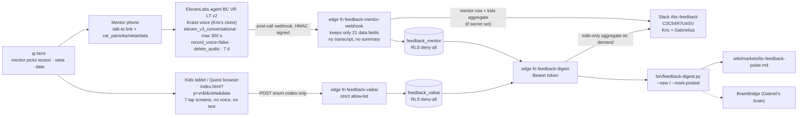

# BC feedback loop v2: architecture

End of every BrAIn Club VR lesson: the mentor talks 2 to 3 minutes with a voice agent, the kids tap 7 answers on a shared tablet or headset. Everything lands in Supabase and in Slack #bc-feedback for Kris and Gabrielius.

| What is collected | Where stored | Who sees it | Retention | Where it is shared |
|---|---|---|---|---|
| Mentor voice call (audio) | Nowhere. `record_voice=false`, `delete_audio=true` | Nobody | 0 | Not shared |
| Mentor call transcript + ElevenLabs auto-summary | ElevenLabs only (needed to run the call) | Kris (ElevenLabs account) | 7 days, then deleted by ElevenLabs | Never copied to Supabase or Slack (v1 bug: the summary leaked a child's name) |
| 21 mentor fields: pamoka, vieta, vaikų sk., data, patiko, nepatiko, neįstrigo, žaidimas/šalmai/gidas taip·dalinai·ne, problemų tipai, problema, kur strigo, pasitikėjimas 1–5, istorija 1–5, išmoko, įdomiausia, prašė daugiau, vaiko citata (no name), įvertinimas 1–10, pataisymas + 4 eval results + duration | Supabase `feedback_mentor` (kris-life-os, EU) | Kris, Gabrielius (via Slack / pulse) | Until deleted (no auto-expiry yet ⚠️) | Slack #bc-feedback · wiki pulse · BrainBridge summary |
| Kids: 8 enum codes per child (1–10 rating, smagiausia, nepatiko, išmoko, panaudos, daugiau, pakviestų draugą, kodėl) + lesson/vieta/data from the QR | Supabase `feedback_vaikai` | Kris, Gabrielius (aggregates only) | Until deleted | Slack #bc-feedback (aggregate: n, avg, top answers, % recommend) · wiki pulse |
| Kids: names, voice, free text, device id, IP | Never collected (endpoint rejects any extra key or non-enum value; IP never read) | Nobody | n/a | n/a |
| Test rows (`t=1`, `bandymas`, `test_*`) | Same tables, `is_test=true` | Kris | Until deleted | Slack only with "🧪 TESTAS" prefix; digest excludes them unless `--test` |

**Why kids never use ElevenLabs:** ElevenLabs Terms §1(a) ban use by anyone under 18. Kids only tap a web page; the question audio they hear is pre-generated TTS in Kris's voice (Kris's own use).

**Secrets** (never in this public repo): `private.app_secrets` rows `elevenlabs_webhook_secret`, `bc_feedback_agents`, `bc_feedback_digest_token`, `slack_webhook_bc_feedback`, read only by `service_role` via `bc_feedback_secret()`.

**Slack de-dup:** each row has `slack_posted_at`. The webhook sets it when it posts; `bin/feedback-digest.py --new` prints what is still unposted and `--mark-posted` records a manual paste, so nothing posts twice.
