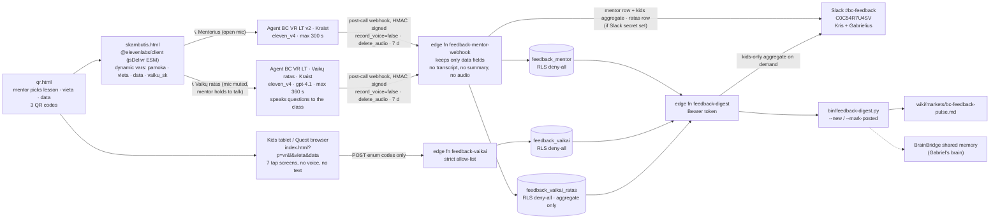

# BC feedback loop v3: architecture

End of every BrAIn Club VR lesson, three inputs, one link: **https://krisvas333.github.io/bc-feedback/skambutis.html** (QR 3 on `qr.html`).
1. **📞 Mentorius call**: the mentor talks 2 to 3 minutes with Kraist (open mic).
2. **📞 Vaikų ratas call**: the mentor holds the phone in front of the class; Kraist SPEAKS each kid question aloud; the mic is muted until the mentor holds the button to relay the group's answer (hands count + short summary). Kids never talk to the phone.
3. **👧 Kids tap page** (no voice): each child taps 7 answers on a shared tablet or headset.
Everything lands in Supabase and in Slack #bc-feedback for Kris and Gabrielius. Lithuanian one-pager for Gabrielius: [ARCHITEKTURA-LT.md](ARCHITEKTURA-LT.md).

**Voice model (all 3 agents, since 2026-09-29): `eleven_v4`** (non-turbo), the most advanced TTS the agent API accepts for LT. Measured over the agent WebSocket (n=8 each): first audio of a reply ~2.9 s (`eleven_v4`) vs ~2.3 s (`eleven_v4_turbo`), first-message audio ~1.0 s vs ~0.25 s. `eleven_v3_conversational` (v1) is superseded. One-line fallback: `TTS_MODEL` in `agents/build.py`.

| What is collected | Where stored | Who sees it | Retention | Where it is shared |
|---|---|---|---|---|
| Mentor voice call (audio) | Nowhere. `record_voice=false`, `delete_audio=true` | Nobody | 0 | Not shared |
| Mentor call transcript + ElevenLabs auto-summary | ElevenLabs only (needed to run the call) | Kris (ElevenLabs account) | 7 days, then deleted by ElevenLabs | Never copied to Supabase or Slack (v1 bug: the summary leaked a child's name) |
| 21 mentor fields: pamoka, vieta, vaikų sk., data, patiko, nepatiko, neįstrigo, žaidimas/šalmai/gidas taip·dalinai·ne, problemų tipai, problema, kur strigo, pasitikėjimas 1–5, istorija 1–5, išmoko, įdomiausia, prašė daugiau, vaiko citata (no name), įvertinimas 1–10, pataisymas + 4 eval results + duration | Supabase `feedback_mentor` (kris-life-os, EU) | Kris, Gabrielius (via Slack / pulse) | Until deleted (no auto-expiry yet ⚠️) | Slack #bc-feedback · wiki pulse · BrainBridge summary |
| Kids: 8 enum codes per child (1–10 rating, smagiausia, nepatiko, išmoko, panaudos, daugiau, pakviestų draugą, kodėl) + lesson/vieta/data from the QR | Supabase `feedback_vaikai` | Kris, Gabrielius (aggregates only) | Until deleted | Slack #bc-feedback (aggregate: n, avg, top answers, % recommend) · wiki pulse |
| Vaikų ratas call (audio) | Nowhere. Same privacy settings as the mentor agent | Nobody | 0 | Not shared |
| Vaikų ratas: 12 group fields, the mentor's words: pamoka, vieta, vaikų sk., įvertinimo vidurkis, smagiausia, nepatiko, išmoko, kur panaudos, ko daugiau, kiek pakviestų draugą („9 iš 12"), kodėl, one child phrase relayed by the mentor (no name) + 4 eval results + duration | Supabase `feedback_vaikai_ratas` | Kris, Gabrielius | Until deleted ⚠️ | Slack #bc-feedback („👧🎙️ Vaikų ratas · BC VR · L… · vieta · data · N vaikų · ⭐ x/10") · digest `ratas` |
| Vaikų ratas when a child talks to the phone | Agent answers „Atsakymus perduoda mentorius" and does not use it; if a child answers 2+ times or the mentor relayed nothing, the webhook stores **nothing** (`mentorius_perdave`, `vaiko_replikos` guard) | Nobody | 0 | Not shared |
| Kids: names, voice, free text, device id, IP | Never collected (endpoint rejects any extra key or non-enum value; IP never read) | Nobody | n/a | n/a |
| Test rows (`t=1`, `bandymas`, `test_*`) | Same tables, `is_test=true` | Kris | Until deleted | Slack only with "🧪 TESTAS" prefix; digest excludes them unless `--test` |

**Why kids never use ElevenLabs:** ElevenLabs Terms §1(a) ban use by anyone under 18 and the Use Policy bans under-13s entirely. Kids only tap a web page, or, in Vaikų ratas, *listen* to Kraist's TTS through the mentor's phone and answer the mentor out loud. The adult mentor is the only ElevenLabs user: the page keeps the mic muted by default and opens it only while the mentor holds the button (pointer, touch or spacebar). The agent never addresses a child as the user, never asks names, and redirects any child who speaks to it.

**Access:** all three agents are public (no signed URL) with an origin allowlist `krisvas333.github.io` + `elevenlabs.io` (tested: another origin is refused with close code 3000). Non-browser clients without an Origin header are still accepted (ElevenLabs `require_origin_header=false`) ⚠️; the only cost is call minutes, the webhook stores nothing without a valid HMAC and a registered agent id.

**Test rows** with `conversation_id` `test_*` build the Slack text but never post it (`slack = "dry"`).

**Secrets** (never in this public repo): `private.app_secrets` rows `elevenlabs_webhook_secret`, `bc_feedback_agents`, `bc_feedback_digest_token`, `slack_webhook_bc_feedback`, read only by `service_role` via `bc_feedback_secret()`.

**Slack de-dup:** each row has `slack_posted_at`. The webhook sets it when it posts; `bin/feedback-digest.py --new` prints what is still unposted and `--mark-posted` records a manual paste, so nothing posts twice.
